- [NB-IoT CoAP协议](#NB-IoT CoAP协议)
  - [协议简介](#协议简介)
  - [CoAP协议主体内容](#CoAP协议主体内容)
  - [协议模型](#协议模型)
  - [消息类型（Messages）](#消息类型（Messages）)
  - [CoAP消息格式](#CoAP消息格式)
  - [CoAP块传输](#CoAP块传输)
  - [CoAP的安全性](#CoAP的安全性)
- [订阅/发布](#订阅/发布)
  - [模型框架](#模型框架)
- [CoAP消息处理流程](#CoAP消息处理流程)
  - [数据上报](#数据上报)
  - [命令下发](#命令下发)
- [Go-CoAP](#Go-CoAP)

### NB-IoT CoAP协议

####  协议简介

**CoAP（Constrained Application Protocol）**是一种在物联网世界的类web协议，它的详细规范定义在 RFC 7252。在物联网应用里面， 设备与设备之间都存在网络里面，它们需要互相进行网络通信。 但由于通常物联网设备都是资源限制型的，有限的CPU能力，有限RAM,有限的flash，有限的网络带宽， 针对此类特殊场景，COAP协议借鉴了HTTP协议机制并简化了协议包格式。简洁地实现了物联网设备之间通信。

##### CoAP 请求/响应工作模式

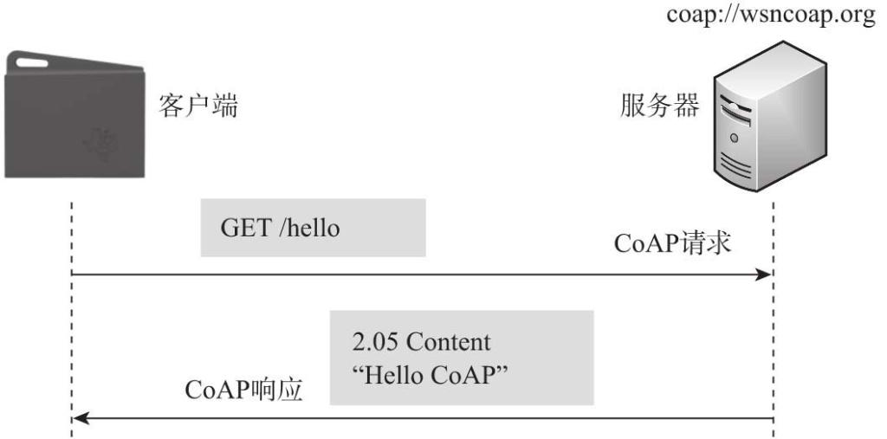

通常由客户端发送CoAP请求，服务器一旦侦听到该请求便会根据请求内容返回响应吗和响应内容。

### CoAP协议主体内容

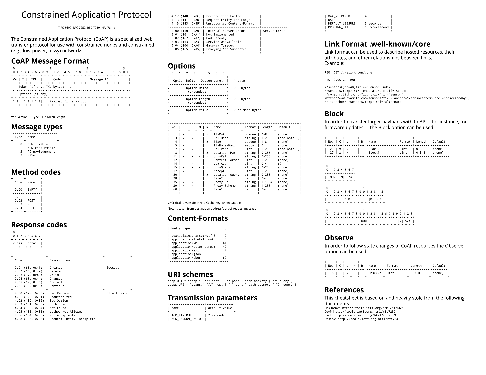

#### 协议模型

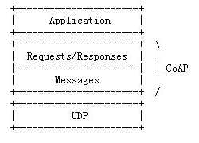

- 传输层改为UDP
- 基于REST
- 二进制格式，轻量化
- 支持可靠传输，数据重传，块传输。确保数据可靠到达
- 支持IP多播，同时向多个设备发送请求
- 非长连接通信

#### 消息类型（Messages）

1.  **CON**——需要被确认的请求，如果CON请求被发送，则对方**必须作出响应**。用以**可靠消息传输**。

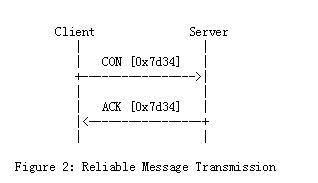

2. **NON**——不需要被确认的请求，如果NON请求被发送，则对方不必做出回应。适用于消息会重复频繁的发送，用以**不可靠消息传输**。

   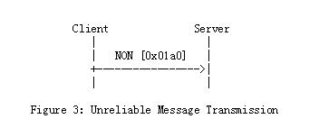

3. **ACK**——应答消息，对应CON消息的应答。
4. **RST**——复位消息，可靠消息传输时接收的消息不认识或错误时，不能回ACK消息，必须回RST消息。

#### CoAP消息格式

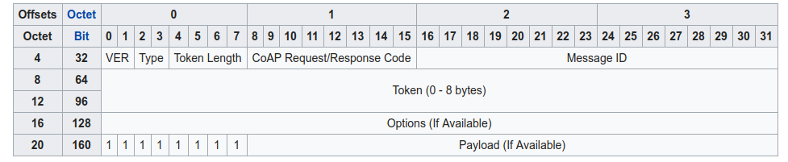

- **消息头（HEAD）**

  第一行为消息头，固定4个byte

  - Ver：2bits，版本信息

  - Type：2bits，消息类型，包括CON（0：Confirmable），NON（1：Non-confirmable），ACK（2：Acknowledgement），RST4（3：Reset）种

  - TKL：4bits，token长度

  - Code：8bits，前3位代表类型，0表示空消息或请求码，2开头代表响应码，格式为<code>class.code</code>，取值如下：
    
    - Method：0.XX
    
      | code | 描述   |
      | ---- | ------ |
      | 0    | EMPTY  |
      | 1    | GET    |
      | 2    | POST   |
      | 3    | PUT    |
      | 4    | DELETE |
      | 5    | FETCH  |
      | 6    | PATCH  |
      | 7    | iPATCH |
    
    - Success：2.XX
    
      | code | 描述     |
      | ---- | -------- |
      | 1    | Created  |
      | 2    | Deleted  |
      | 3    | Vaild    |
      | 4    | Changed  |
      | 5    | Content  |
      | 31   | Continue |
    
    - Client Error：4.XX
    
      | code | 描述                       |
      | ---- | -------------------------- |
      | 0    | Bad Request                |
      | 1    | Unauthorized               |
      | 2    | Bad Option                 |
      | 3    | Forbidden                  |
      | 4    | Not Found                  |
      | 5    | Method Not Allowed         |
      | 6    | Not Acceptable             |
      | 8    | Request Entity Incomplete  |
      | 9    | Conflict                   |
      | 12   | Precondition Failed        |
      | 13   | Request Entity Too Large   |
      | 15   | Unsupported Content-Format |
    
    - Server Error：5.XX
    
      | code | 描述                   |
      | ---- | ---------------------- |
      | 0    | Internal Server Error  |
      | 1    | Not Implemented        |
      | 2    | Bad Gateway            |
      | 3    | Service Unavailable    |
      | 4    | Gateway Timeout        |
      | 5    | Proxying Not Supported |
    
    - Signaling Codes：7.XX
    
      | code | 描述       |
      | ---- | ---------- |
      | 0    | Unassigned |
      | 1    | CSM        |
      | 2    | Ping       |
      | 3    | Pong       |
      | 4    | Release    |
      | 5    | Abort      |
    
  - Message ID：16bit，消息MID，每个消息都含有一个ID，重发的消息MID不变

- **token（可选）**

- **option（可选，0个或多个）**

  主要用于描述请求或响应对应的各个属性，

  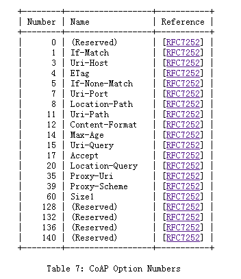

- **payload（可选）**

  实际携带数据的内容。

- **CoAP请求码（requests）和响应码（responses）**

  - GET方法——获取某资源
  - POST方法——创建某资源
  - PUT方法——更新某资源
  - DELETE方法——删除某资源

##### 请求例子（二进制格式），相较HTTP包更小，可双向通信

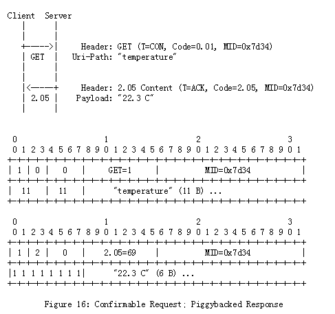

#### CoAP的URL

开头为“coap”对应“http”或“coaps”对应“https”。coap默认端口udp（5683），coaps为5684

#### CoAP块传输

块传输协议在CoAP基础协议上增加了4个options（其中size1最早在RFC7252中定义，RFC7959进行了扩展），2个response codes用于块传输大小协商及控制。

##### option

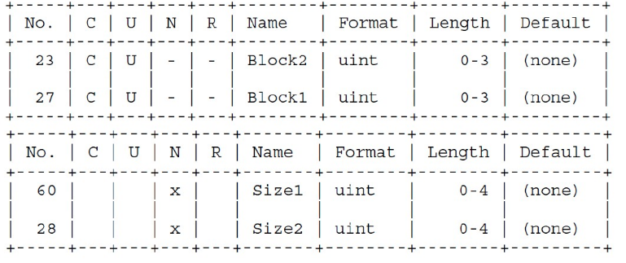

采用Block1和Size1完成Request中Resource Presentation的块传输。

采用Block2和Size2完成Response中Resource Presentation的块传输。

##### Response Code

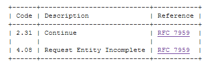

- Continue：表明Server收到了本次通过Request传输的块，期望Client继续发送下一个块，目前还不能执行该Request，返回最终的Response。
- Request Entity Incomplete：表明Server由于多种原因：Client未发送所有块了；没有按Server要求的顺序发送块；块发送时间跨度太大导致Server已丢弃块，未能完成body的接收。

##### block option结构

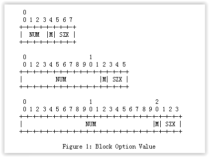

- NUM：具有给定大小的块序列内的块的相对数（从0开始编号），即快序号
- M：是否有更多块
- SZX：block size，3bit，取值0-6，实际每个块的payload为**2^(4+SZX)**，即块大小为16~1024字节

#### CoAP的安全性

COAP的安全性是用DTLS加密实现的，运行在UDP之上。DTLS的实现需要的资源和带宽较多，如果是资源非常少的终端和极有限的带宽下可能会跑不起来。DTLS仅仅在单播情况下适用。

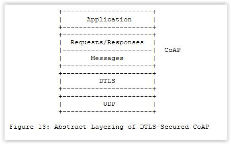

### 订阅/发布

MQTT协议基于订阅/发布模型，CoAP协议通过扩展方式简单的实现了订阅/发布模型。[RFC9641](https://tools.ietf.org/html/rfc7641)

#### 模型框架

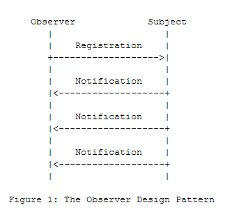

- Subject（主题）：代表CoAP服务器上的某resource（资源），该资源状态随时可能发生变化
- Observer（观察者）：代表某个CoAP资源最新状态感兴趣的客户端CoAP Client
- Registration（登记）：观察者需要向服务器CoAP Server登记感兴趣的Subject
- Notification（通知）：当CoAP观察到某个Subject发生状态变化时，CoAP服务器会主动向该Subject下已登记的观察者列表里的每个观察者发送其订阅的Subject最新状态数据。

观察协议在CoAP基础协议上增加了一个Observe option，其值为整数，通过该option来实现订阅/发布模型管理。

在GET请求中，

- observe value为0：向服务器订阅一个Subject
- observe value为1：向服务器移除一个已订阅Subject

在Notification中，observe value代表Subject发生变化时，检测到的顺序。

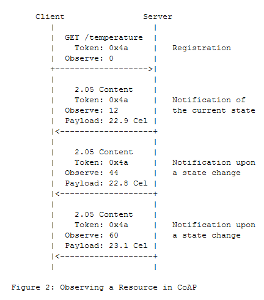

1. 客户端向服务器登记感兴趣的Subject /temperature
2. 当temperature发生状态改变时，服务器主动通知客户端
3. 客户端根据token，与之前订阅Subject进行关联，以此确定是哪个Subject订阅的。

### CoAP消息处理流程

##### 数据上报

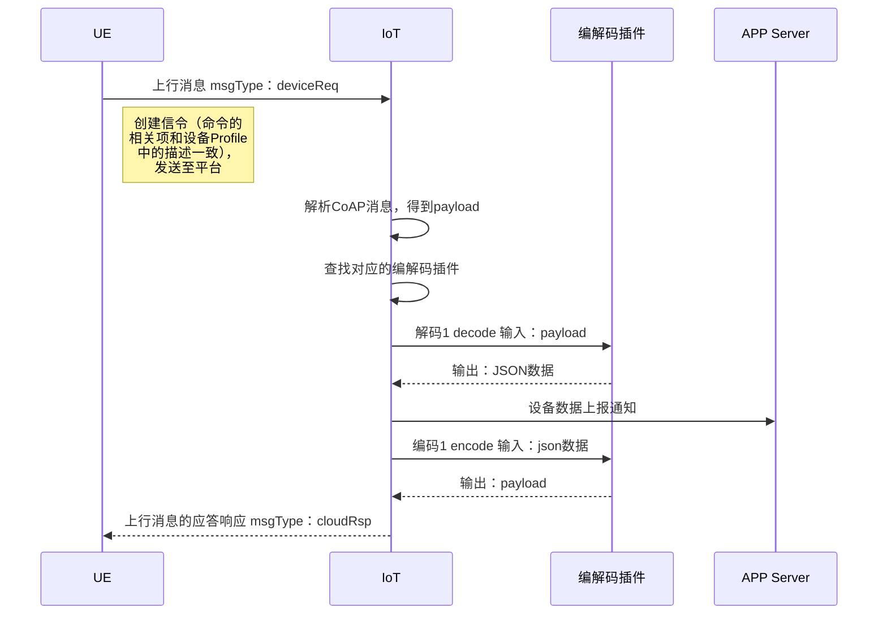

##### 命令下发

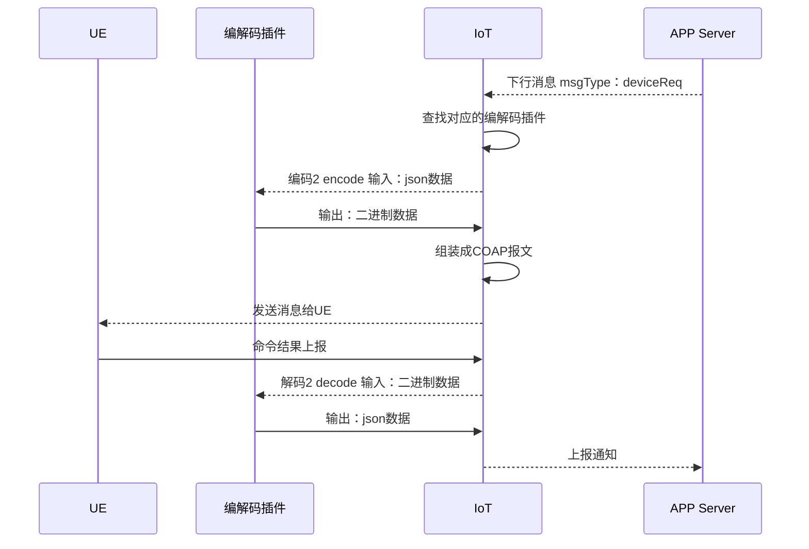

#### Go-CoAP

- [Go-CoAP](https://github.com/go-ocf/go-coap)

  feature：Core, Observe, Blockwise, Multicast, TCP/TLS

- [CoAP implementation for Go](https://github.com/dustin/go-coap)

  feature：Core + Draft Subscribe

- [Canopus](https://github.com/zubairhamed/canopus)

  feature：Core
