- [LTE](#LTE)
  - [协议栈与流](#协议栈与流)
  - [子层运行方式](#子层运行方式)
    - [NAS协议(非接入层协议)](#NAS协议(非接入层协议))
    - [RRC层(无线资源控制层)](#RRC层(无线资源控制层))
    - [PDCP层(分组数据汇聚协议层)](#PDCP层(分组数据汇聚协议层))
    - [RLC层(无线链路控制层)](#RLC层(无线链路控制层))
    - [MAC层(媒体接入层)](#MAC层(媒体接入层))
    - [PHY层(物理层)](#PHY层(物理层))
  - [LTE信令流程](#LTE信令流程)
- [NB-IoT](#NB-IoT)
  - [NB-IoT网络架构](#NB-IoT网络架构)
  - [协议栈](#协议栈)
    - CP(控制面)协议栈
    - UP(用户面)协议栈
  - [NB-IoT传输方式](#NB-IoT传输方式)
    - [EPS优化方案](#EPS优化方案)
    - [CP传输方案信令流程](#1 CP传输方案信令流程)
    - [UP传输方案信令流程](#2 UP传输方案信令流程)
    - [RRC挂起流程](#RRC挂起流程)
    - [RRC恢复流程](#RRC恢复流程)
- [信令流程及空口信令条数对比](#信令流程及空口信令条数对比)
- [CP方案与UP方案对比](#CP方案与UP方案对比)

## LTE[TOP](#top)

### 协议栈与流

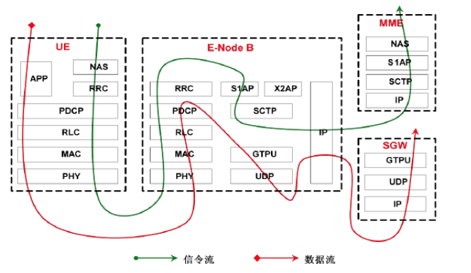

[NAS协议(非接入层协议)](#NAS协议(非接入层协议))  [RRC层(无线资源控制层)](#RRC层(无线资源控制层))  [PDCP层(分组数据汇聚协议层)](#PDCP层(分组数据汇聚协议层))  

[RLC层(无线链路控制层)](#RLC层(无线链路控制层))  [MAC层(媒体接入层)](#MAC层(媒体接入层))  [PHY层(物理层)](#PHY层(物理层))

### 子层运行方式

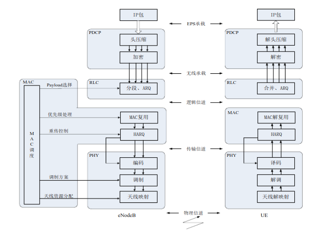

#### NAS协议(非接入层协议)[TOP](#top)

处理UE和MME之间**信息的传输**，传输内容为用户信息或控制信息。

**功能**

- 会话管理：会话建立、修改、释放及QoS协商
- 用户管理：用户数据管理，以及附着、去附着
- 安全管理：用户与网络之间的鉴权及加密初始化
- 计费

#### RRC层(无线资源控制层)[TOP](#top)

支持终端和eNodeB之间多种功能的重要**信令协议**。

**功能**

- 广播NAS层和AS层的系统消息
- 寻呼功能(通过PCCH逻辑信道执行)
- RRC连接建立、保持和释放
- 安全功能，秘钥管理
- 端到端无线承载的建立、修改和释放
- 移动性管理
- QoS管理
- UE测量上报及测量控制
- NAS消息传输及完整性保护

#### PDCP层(分组数据汇聚协议层)[TOP](#top)

负责执行**头压缩**及**减少**无线接口必须传送的**比特流量**。

**功能**

- IP包头压缩与解压缩
- 数据与信令的加密
- 信令的完整性保护

#### RLC层(无线链路控制层)[TOP](#top)

负责**分段与连接**、**重传处理**，以及对**高层数据的顺序传送**。RLC以无线承载方式为PDCP层提供服务，每个终端的每个无线承载配置一个RLC实体。RLC拥有三种传送模式：

- 透明模式（Transparent Mode，TM）

  对上层的数据不进行任何改变，常用于BCCH（广播控制信道）或PCCH（寻呼控制信道）逻辑信道的传输，该方式无需对RLC层进行任何特殊处理。

- 非确认模式（Unacknowledged Mode，UM）

  支持数据包丢失检测，并提供分组数据包的排序和重组。用于任何专用或多播逻辑信道，具体依赖于应用及QoS类型。

- 确认模式（Acknowledged Mode，AM）

  支持数据包丢失检测，并提供分组数据包的排序和重组时要求它的对等实体重组分组数据包，即ARQ机制。仅用于DCCH（专用控制信道）或DTCH（专用业务信道）逻辑信道，常用于TCP的业务。

#### MAC层(媒体接入层)[TOP](#top)

负责处理HARQ重传与上下行调度。为RLC层业务与物理层之间提供一个有效的连接，功能：

- 逻辑信道与传输信道之间的映射
- 传输格式的选择，如传输块大小
- 一个UE或多个UE之间逻辑信道的优先级管理
- 通过HARQ机制进行纠错
- 填充（Padding）
- RLC PDU的复用与解复用
- 业务量的测量与上报

MAC层给**上层**提供的业务：

- 数据传送及无线资源分配

物理层给**MAC层**提供的业务：

- 数据传送
- HARQ反馈信令
- 调度请求信令及测量

#### PHY层(物理层)[TOP](#top)

负责处理编译码、调制解调、多天线映射及其他电信物理层功能，以**传输信道**的方式为MAC层提供服务，包含功能：

- 传输信道的错误检测及向高层提供提示
- 传输信道的前向接错编码（FEC）与译码
- 物理信道的调制与解调

### LTE信令流程

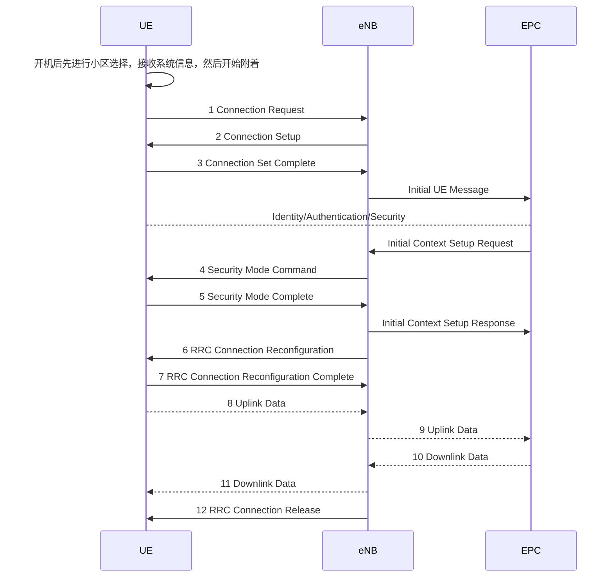

## NB-IoT

### NB-IoT网络架构[TOP](#top)

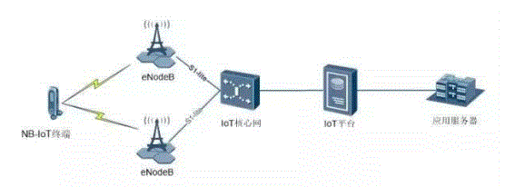

- **NB-IoT终端**：通过空口连接到基站
- **eNodeB**：承担空口接入处理，小区管理等相关功能
- **IoT核心网**：承担与终端非接入层交互的功能，并将IoT业务相关数据转发到IoT平台4
- **IoT平台**：汇聚从各种接入网得到的IoT数据，并根据不同类型转发至相应的业务服务器
- **应用服务器**：根据客户的需求进行数据处理等操作

### 协议栈[TOP](#top)

#### CP(控制面)协议栈

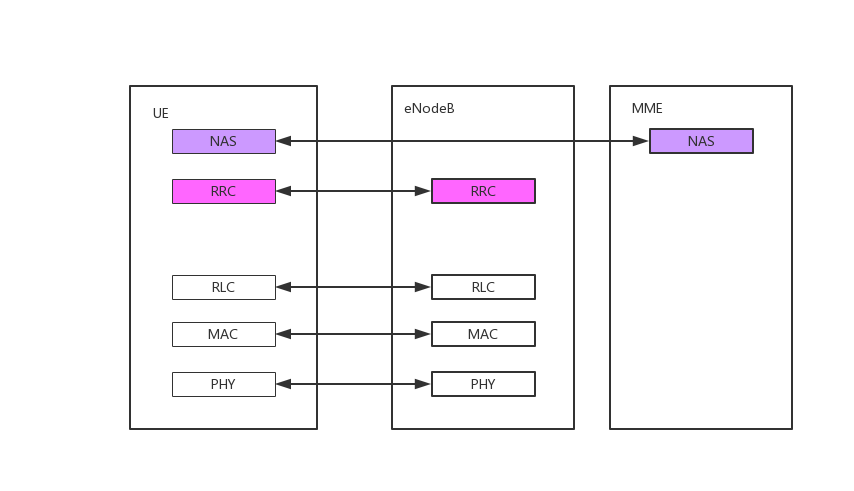

UE与eNodeB传输数据不需要启动安全模式，安全性由NAS层负责；RLC层与RRC层数据直接交互，上行数据在上行RRC消息包含的NAS消息中携带，下行数据同理。

#### UP(用户面)协议栈

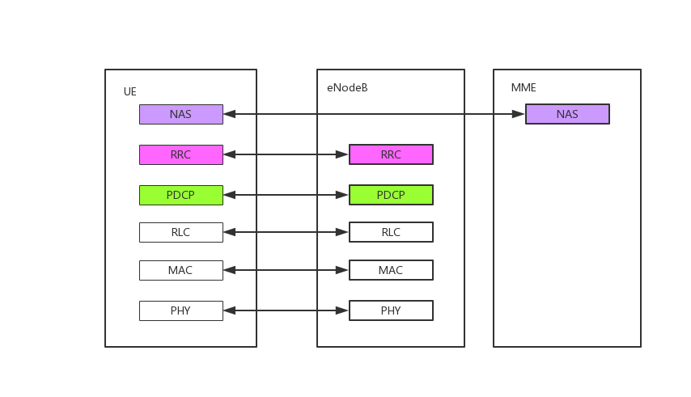

上下行数据通过DRB承载携带，PDCP层提供AS层安全模式

### 状态转换

#### Connected（连接态）

#### Idle（空闲态）

### NB-IoT传输方式[TOP](#top)

#### EPS优化方案

- CIoT EPS控制面功能优化（Control Plane CIoT EPS optimisation）
- CIoT EPS用户面功能优化（User Plane CIoT EPS optimisation）

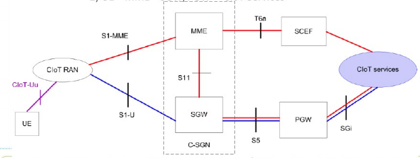

如上图，**红线**表示CIoT EPS**控制面功能优化**（Control Plane CIoT EPS optimisation）方案，**蓝线**表示CIoT EPS**用户面功能优化**（User Plane CIoT EPS optimisation）方案。在实际网络部署时，为了减少物理网元的数量，可以将核心网网元(如MME、SGW、PGW)合一不部署，称为CIoT服务网关节点C-SGN，如虚框中所示。

- SCEF，服务能力开放平台，为新引入**网元**
- **CP**无需建立DRB，可直接通过控制平面高效传送用户数据（IP和Non-IP）和SMS。小数据包通过NAS信令传输至MME，然后发往T6a或S11接口，得出两种传输路径：
  - UE—MME—SCEF—CIoT Services
  - UE—MME—SGW/PGW—CIoT Services
- **UP**通过新定义的[挂起流程](#RRC挂起流程)和[恢复流程](#RRC恢复流程)使UE不再需要Service Request过程既能从EMM-IDLE状态迁移至EMM-CONNECTED状态（RRC状态从IDLE变为CONNECTED），减少相关空口资源和信令开销。

#### 1 CP传输方案信令流程[TOP](#top)

> CP，即控制面：负责传送和处理系统协调信令的协议

针对小数据传输进行了优化，支持将IP数据包、非IP数据包或SMS封装到NAS**协议数据单元**（PDU）中传输，无须建立**数据无线承载**（DRB）和基站与S-GW之间的S1-U承载，节省了终端和系统的开销，简化了终端和网络的实现，节省端到端各网元的成本。

控制面数据传输是通过RRC、S1-AP协议进行NAS传输，并通过MME与S-GW之间，以及S-GW与P-GW之间的**GTP-U隧道**来实现。对于非IP数据，也可以通过MME与SCEF之间的连接来实现。

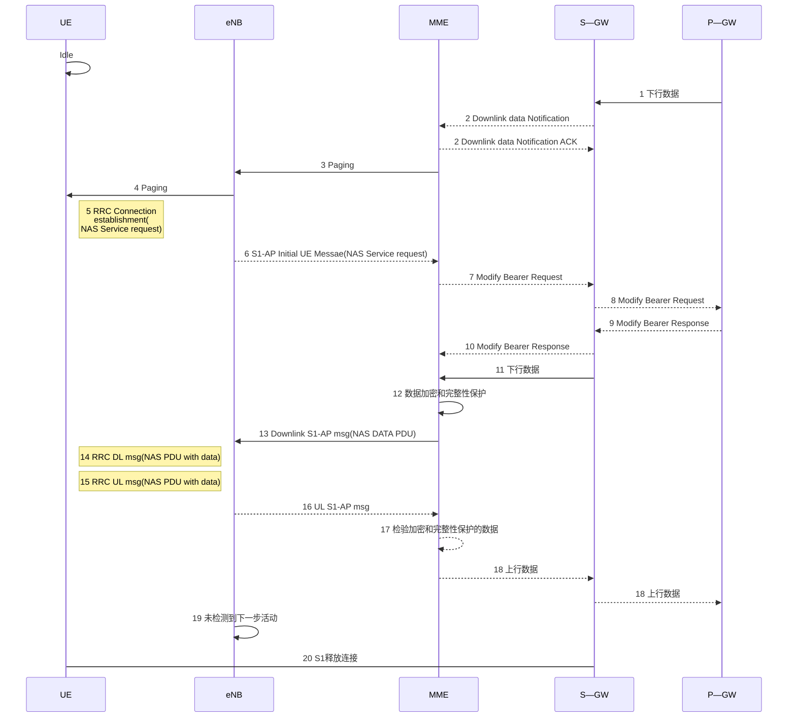

1～2：P-GW发送下行数据给S-GW，并通知MME。

3～4：MME发起对UE的寻呼过程。

5～6：UE进行RRC连接过程，将UE从idle态变为connect态，同时建立S1连接。

7～10：MME完成与S-GW的用户面建立过程，S-GW完成与P-GW的用户面建立过程。

11～14：S-GW将数据通过用户面发送到MME，MME通过NAS消息将数据发送到UE。

15～18：UE将上行数据通过NAS消息发送到MME，MME通过用户面将数据发送到P-GW。

19～20：进行RRC连接及S1连接的释放。

#### 2 UP传输方案信令流程[TOP](#top)

> UP，即用户面：负责传送和处理用户数据流工作的协议

使空闲态用户快速恢复到连接态，并减少终端和网络交互的信令。

用户面传输过程通过优化现有传输方式，终端需要传输数据时，需要分为两个过程：一个是[挂起流程](#RRC挂起流程)，另一个是[恢复流程](#RRC恢复流程)。

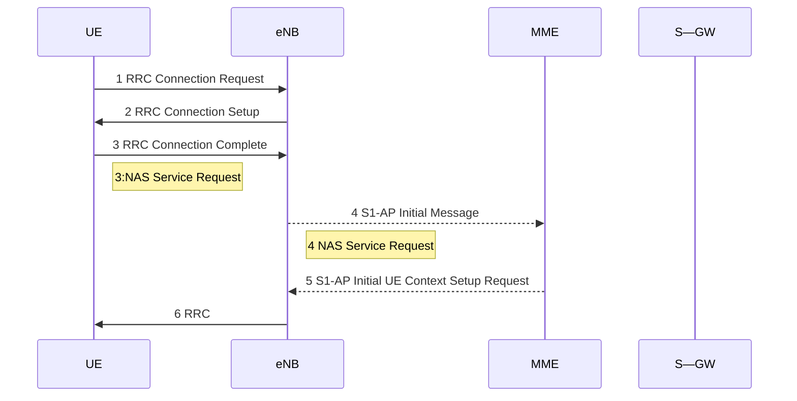

- NB-IoT在UP模式中，为减少空口信令交互引入了**Suspend/Resume流程**
- eNB保存UE、AS上下文信息，UE从RRC连接状态转为Idle状态，终端在Idle（Suspend）状态下，需要传输数据时，可直接通过Resume流程，直接建立RRC连接，节省空口加密，承载建立等信令消息和流程。

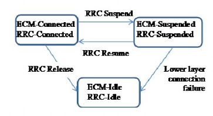

#### RRC挂起流程[TOP](#top)

终端与网络建立好接入层（Access Strautm，AS）信息后，基站发起挂起流程后，UE存储相关的AS层信息，如：承载信息及安全信息，基站存储相关的AS信息及S1AP的关联信息。UE进入Idle状态相关存储的信息不删除，进行恢复时不需要重新进行这些相关信息的建立，直接进行恢复。

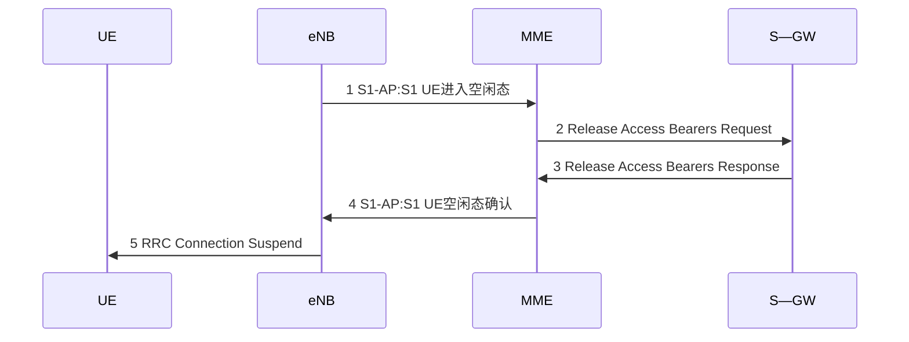

#### RRC恢复流程[TOP](#top)

终端与网络挂起后，终端需要发送数据时，直接发起恢复流程，终端和基站直接进行相关信息的恢复，不再需要重新进行承载建立及安全信息的重协商。直接进行恢复加快了恢复速度同时节省了信令。

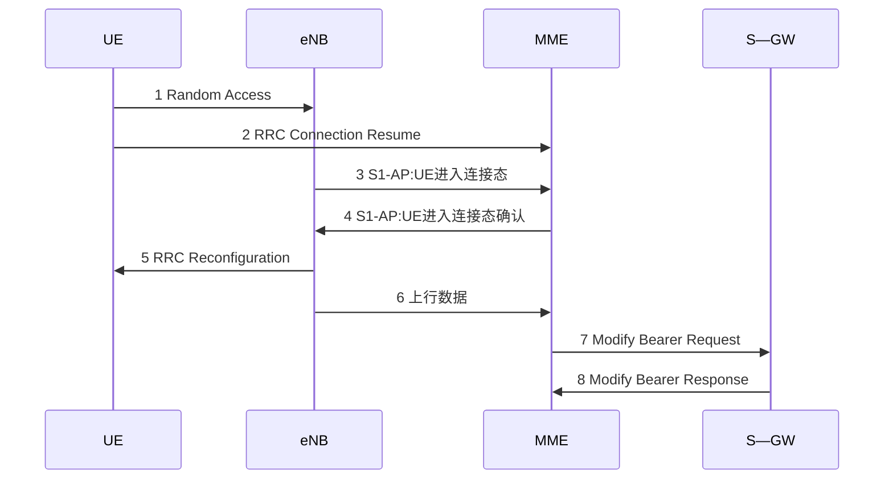

## 信令流程及空口信令条数对比[TOP](#top)

|              | LTE  | CP   | UP   |
| ------------ | ---- | ---- | ---- |
| 空口信令条数 | 8    | 4    | 5    |

#### LTE信令

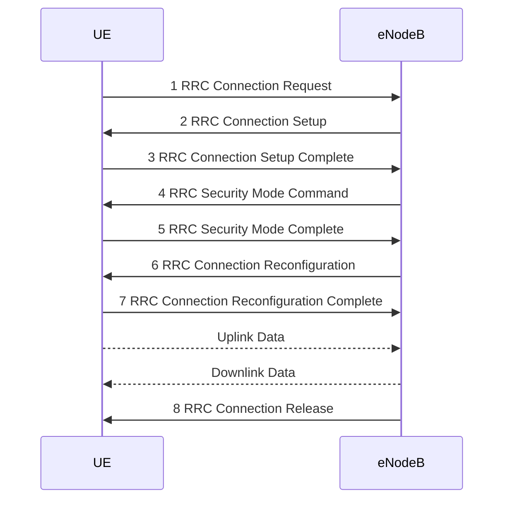

#### CP方案信令

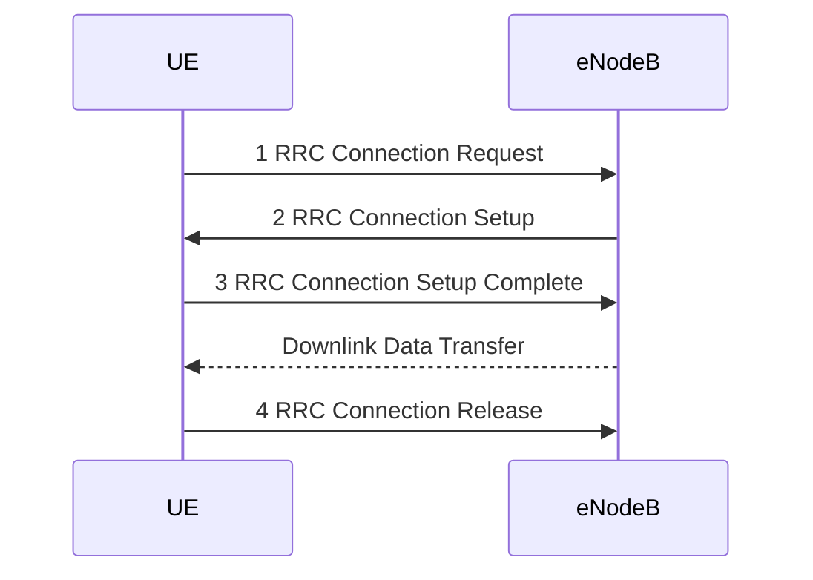

#### UP方案信令

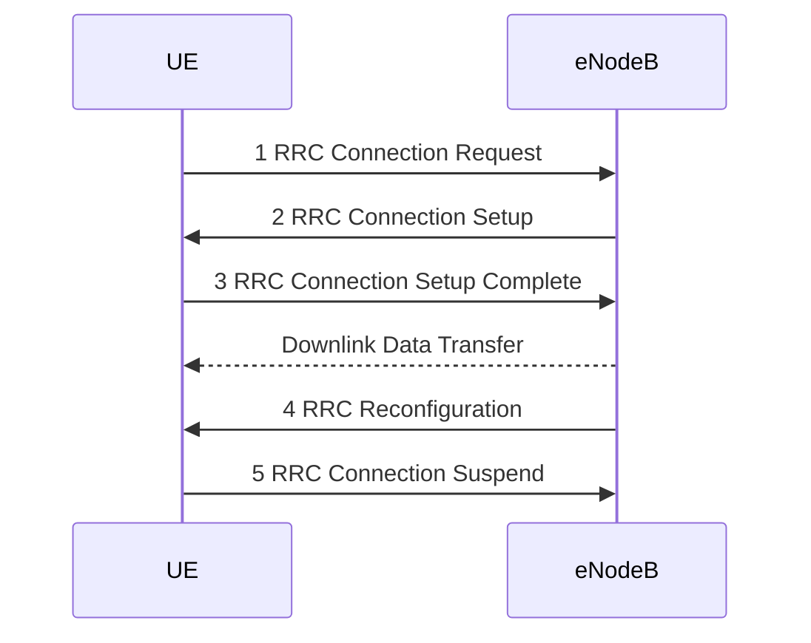

## CP方案与UP方案对比[TOP](#top)

| **对比维度** | **CP方案**                                                   | **UP方案**                                                   |
| ------------ | ------------------------------------------------------------ | ------------------------------------------------------------ |
| 3GPP标准化   | 必选方案                                                     | 可选方案                                                     |
| 信令开销     | 传输数据时空口节省约50%的信令                                | 传输数据时空口节省约50%的信令，相对CP方案，增加了PDN建立时用户面承载建立信令 |
| 业务多样性   | 单一QoS业务                                                  | 支持多QoS业务                                                |
| 传输小包效率 | 高，RRC建立时随路发送数据                                    | 低，先恢复RRC连接，再从用户面发送数据                        |
| 传输大包效率 | 低，数据需分多个包，每个包都需封装在NAS信令中传输，效率低。(单个NAS PDU最大64kb) | 高，多个数据包从用户面直接传输，效率高                       |
| 移动场景     | 适合                                                         | 跨基站移动时，需通过X2接口传递用户上下文，信令开销较大       |
| 开发难度     | 核心网改造大，基站改造小                                     | 核心网改造小，基站改造大                                     |
| 存储要求     | 无额外存储要求                                               | 挂起是，基站、核心网都需要缓存用户上下文信息                 |
